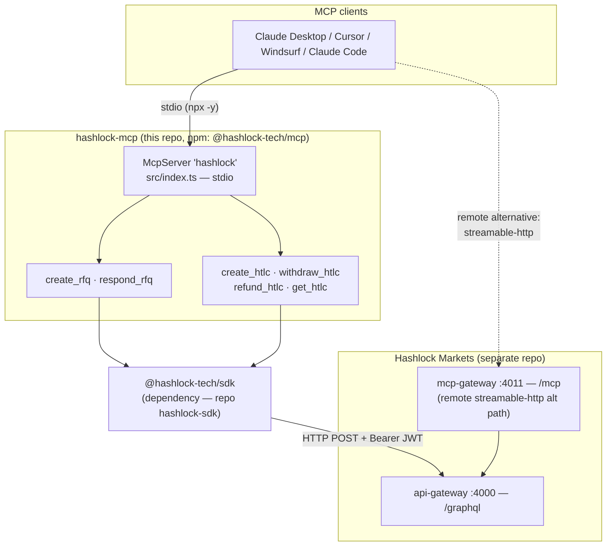
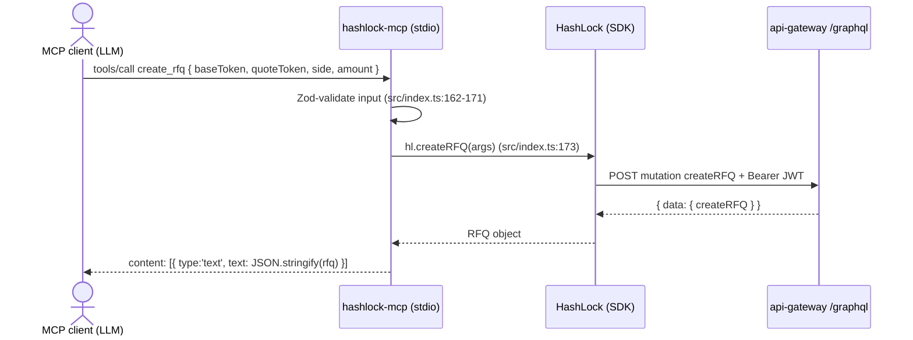

<!-- Language: **English** · [Русский](./ARCHITECTURE.ru.md) -->

# hashlock-mcp — Architecture

> **The authoritative architecture reference for this repository.** It explains what this
> package is, how its parts connect, how a tool call flows from an AI agent to the Hashlock
> Markets backend and back, and the reasoning behind the design — verified against `main`
> (counts reflect the code as of 2026-05-30).
>
> This is the **publishable, stdio MCP server** for Hashlock Markets. For the system it
> ultimately talks to, read the master doc:
> [**hashlock-markets / ARCHITECTURE.md**](https://github.com/Hashlock-Tech/hashlock-markets/blob/main/docs/architecture/ARCHITECTURE.md).
>
> Every non-obvious claim points at a `path:line` you can open. If a number here ever
> disagrees with the code, the code wins — please fix the doc.

---

## 1. What it is, and the core idea

`@hashlock-tech/mcp` is the **canonical Model Context Protocol server** for Hashlock Markets,
distributed on npm and runnable with `npx`. It lets any MCP-compatible client — Claude
Desktop, Cursor, Windsurf, Claude Code — drive Hashlock Markets trading (create RFQs, quote
as a maker, record HTLC locks, claim/refund, query status) through six tools.

The whole server is **one file** — `src/index.ts` (206 lines) — that registers **6 tools** on
an `McpServer` and serves them over **stdio** (`src/index.ts:25,198`). It holds no business
logic of its own: every tool is a thin adapter that calls a method on the
[`@hashlock-tech/sdk`](https://github.com/Hashlock-Tech/hashlock-sdk) client (a direct
dependency, `package.json:33`), which in turn speaks GraphQL to the backend.

```
AI agent (MCP client)  →  hashlock-mcp (this, stdio)  →  @hashlock-tech/sdk  →  api-gateway /graphql
```

### Why it is built this way (the load-bearing decisions)

| Decision | Why |
|---|---|
| **Thin adapter over the SDK** | The server adds no transport, retry, or schema logic — it imports `HashLock` (`src/index.ts:4,18`) and forwards. All network behaviour (retries, error mapping, the `/graphql` target) lives in the SDK, so the two repos can't drift on protocol. |
| **stdio transport** | `StdioServerTransport` (`src/index.ts:198`) is what desktop MCP clients launch as a subprocess. The `bin` entry + shebang banner (`package.json:15-17`, `tsup.config.ts:11`) make the built `dist/index.js` directly executable via `npx -y @hashlock-tech/mcp`. |
| **The `create_rfq` description is an LLM prompt, not just docs** | Its 59-line description constant (`src/index.ts:99-157`) is an **intent compiler**: it teaches the model to map free-text (EN + Turkish) to structured params, infer chains, and *restate-and-confirm before spending real funds*. Tests pin its load-bearing keywords (`src/__tests__/tools.test.ts:201-279`) so a copy-edit can't silently change agent behaviour. |
| **Six canonical tools, mirroring the backend** | The tool set (`create_rfq`, `respond_rfq`, `create_htlc`, `withdraw_htlc`, `refund_htlc`, `get_htlc`) is the **same canonical six** the backend `mcp-gateway` exposes — this package is the *downloadable stdio sibling* of that production HTTP path (see §8). |
| **Secrets only via env** | The SIWE JWT is read from `HASHLOCK_ACCESS_TOKEN` (`src/index.ts:16`); nothing is hard-coded. The MCP-Registry/Smithery manifests mark it `isSecret` (`mcp-registry.json:36`, `smithery.yaml:13`). |

---

## 2. System at a glance



**Reading it:** an MCP client launches this server as a stdio subprocess and calls its tools.
Each tool forwards to the SDK, which POSTs to the backend's **`/graphql`** with the agent's
Bearer JWT. The dotted edge is the **alternative**: instead of running this package locally, a
client can connect directly to the remote `https://hashlock.markets/mcp` endpoint (the
backend's `mcp-gateway`) — both paths expose the same six tools (`README.md:22-54`).

---

## 3. Package layout

`git ls-files` is 18 files. The code is a single module; the rest is distribution and config:

| File | Role |
|---|---|
| `src/index.ts` | The entire server: SDK client setup, 6 tool registrations, stdio bootstrap (`src/index.ts:1-206`). |
| `src/__tests__/tools.test.ts` | ~30 cases — tool→SDK integration, the `create_rfq` description-keyword pins, experimental-field passthrough, error scenarios. |
| `package.json` | npm metadata: name `@hashlock-tech/mcp`, `bin: hashlock-mcp`, deps on the SDK + MCP SDK + zod (`package.json:2,15-17,32-36`). |
| `mcp-registry.json` | Official **MCP Registry** manifest (`io.github.Hashlock-Tech/hashlock`): both the npm/stdio package and the remote streamable-http endpoint (`mcp-registry.json:13-59`). |
| `smithery.yaml` | **Smithery.ai** install manifest (stdio via npx, config schema). |
| `glama.json` | **Glama.ai** directory pointer (maintainer). |
| `llms-install.md` | Agent-readable install guide for auto-discovery. |
| `tsup.config.ts` | Build: ESM-only + `.d.ts`, shebang banner so the output is executable (`tsup.config.ts:5,11`). |
| `.github/workflows/ci.yml`, `tsconfig.json`, `vitest.config.ts`, `CHANGELOG.md`, `LICENSE`, `.env.example` | CI, TS config, tests, history, license, env template. |

---

## 4. The six tools (the heart of the package)

Each `server.tool(name, description, zodSchema, handler)` registration validates input with a
Zod schema and forwards to exactly one SDK method:

| Tool | Registered at | Calls (SDK) | Purpose |
|---|---|---|---|
| `create_rfq` | `src/index.ts:159` | `createRFQ` | Open a sealed-bid RFQ (intent-compiled description, §5) |
| `respond_rfq` | `src/index.ts:180` | `submitQuote` | Maker submits a sealed quote |
| `create_htlc` | `src/index.ts:32` | `fundHTLC` | Record an on-chain HTLC lock tx hash |
| `withdraw_htlc` | `src/index.ts:52` | `claimHTLC` | Claim by revealing the preimage |
| `refund_htlc` | `src/index.ts:69` | `refundHTLC` | Refund after timelock expiry |
| `get_htlc` | `src/index.ts:85` | `getHTLCStatus` | Read live HTLC status (both legs) |

Every handler returns the SDK result JSON-stringified into MCP `content` (e.g.
`src/index.ts:45-46`). Because the tools delegate to the SDK, the **chain-awareness**,
**multi-chain support** (EVM / Bitcoin / Sui via the `chainType` param), and **cross-chain
RFQ** semantics are exactly the SDK's — see the
[hashlock-sdk architecture doc](https://github.com/Hashlock-Tech/hashlock-sdk/blob/main/docs/architecture/ARCHITECTURE.md).

> **The "record, don't sign" boundary carries over:** `create_htlc` does **not** broadcast a
> transaction — it records a `txHash` the agent's wallet already broadcast on-chain. The
> backend's chain-watcher remains the sole authority for trade state
> ([master doc §5.2/§5.6](https://github.com/Hashlock-Tech/hashlock-markets/blob/main/docs/architecture/ARCHITECTURE.md#52-htlc-settlement-on-one-evm-chain)).

---

## 5. The `create_rfq` intent compiler

The single most distinctive piece of this repo is **prose, not code**: the description string
passed to `create_rfq` (`src/index.ts:99-157`). MCP tool descriptions are read by the *model*,
so this string is effectively a sub-prompt that turns a user's natural-language request into
the structured `create_rfq` params. It encodes:

- **Verb → side mapping** in English *and Turkish* (`sell/sat → SELL`, `buy/al → BUY`,
  `src/index.ts:114-117`).
- **Chain inference defaults** (ETH/USDC/USDT/WBTC/WETH → `ethereum`, BTC → `bitcoin`,
  SUI → `sui`) with an explicit rule **never to silently testnet-ify an unqualified leg**
  (`src/index.ts:119-124`).
- **Safety rails**: pass raw decimal amounts (don't pre-convert to wei/sats), reject
  USD-denominated sizes, and **RESTATE the resolved deal and get confirmation before calling
  — "Real funds"** (`src/index.ts:126-143`).
- Worked **examples**, including a cross-chain `SUI/sui ↔ ETH/sepolia` exemplar
  (`src/index.ts:145-156`).

`src/__tests__/tools.test.ts:201-279` reads the source back and asserts each rule is still
present — a regression guard that treats the prompt as load-bearing behaviour, not docs.

---

## 6. Flows & transports

### 6.1 A tool call, end to end



### 6.2 Two ways to connect (same six tools)
- **Local stdio (this package)** — `npx -y @hashlock-tech/mcp` with `HASHLOCK_ACCESS_TOKEN`
  in env (`README.md:40-54`, `smithery.yaml:6-9`). The SDK targets `/graphql`.
- **Remote streamable-http** — point the client at `https://hashlock.markets/mcp` with an
  `Authorization: Bearer` header (`README.md:22-38`, `mcp-registry.json:46-59`). That endpoint
  is the backend `mcp-gateway` (nginx routes `/mcp` → `mcp-gateway:4011`,
  [master doc §8.1](https://github.com/Hashlock-Tech/hashlock-markets/blob/main/docs/architecture/ARCHITECTURE.md#81-two-mcp-servers-do-not-conflate)).

### 6.3 Authentication
Both paths use a **SIWE 7-day JWT** from `hashlock.markets/sign/login` (`README.md:62-70`).
This server never mints it — it only carries it (env var → SDK `accessToken`,
`src/index.ts:16,20`), matching the SDK's "bearer-token consumer, not auth provider" model
([master doc §5.5](https://github.com/Hashlock-Tech/hashlock-markets/blob/main/docs/architecture/ARCHITECTURE.md#55-authentication--human-siwe-and-agent-otk)).

---

## 7. Distribution & discovery

The package is published across four agent-discovery surfaces, all pointing at the same npm
artifact:

| Surface | Manifest | Identifier |
|---|---|---|
| **npm** | `package.json` | `@hashlock-tech/mcp` |
| **MCP Registry** | `mcp-registry.json` | `io.github.Hashlock-Tech/hashlock` (server `1.2.0`, `mcp-registry.json:11`) |
| **Smithery.ai** | `smithery.yaml` | stdio via `npx` (slug `bsozen-4wm5/hashlock-otc-v1`, `README.md:12`) |
| **Glama.ai** | `glama.json` | maintainer `BarisSozen` |

`README.md:140-145` deprecates two legacy packages (`hashlock-mcp-server`, `langchain-hashlock`)
that depended on an intent REST API that "was never shipped" — a useful honest signal about the
project's history.

---

## 8. How this repo connects to hashlock-markets

This package is one of the sibling repos catalogued in the master doc's
[§3 "repositories and how they connect"](https://github.com/Hashlock-Tech/hashlock-markets/blob/main/docs/architecture/ARCHITECTURE.md#3-the-repositories-and-how-they-connect)
and is central to its
[§8 "agent / MCP surface"](https://github.com/Hashlock-Tech/hashlock-markets/blob/main/docs/architecture/ARCHITECTURE.md#8-the-agent--mcp-surface).

| Connection | Detail |
|---|---|
| **Dependency chain** | `hashlock-mcp` → `@hashlock-tech/sdk` (`package.json:33`) → api-gateway `/graphql`. This server inherits the SDK's endpoint, retry, and error behaviour wholesale. |
| **Tool contract = mcp-gateway's** | The six tools here are the **same canonical six** the backend `mcp-gateway` exposes ([master §8.1](https://github.com/Hashlock-Tech/hashlock-markets/blob/main/docs/architecture/ARCHITECTURE.md#81-two-mcp-servers-do-not-conflate)). This package is the **local-stdio sibling**; `mcp-gateway` is the remote-HTTP production path. The remote install option literally points at it (`https://hashlock.markets/mcp`). |
| **Do NOT conflate with `services/remote-mcp`** | The master doc warns of two backend MCP servers. This package mirrors **`mcp-gateway`** (6 canonical settlement tools), **not** `services/remote-mcp` (5 *intent* tools over an external REST API). Different tools, different backend. |
| **Auth model** | Consumes the SIWE JWT minted by auth-service ([master §5.5](https://github.com/Hashlock-Tech/hashlock-markets/blob/main/docs/architecture/ARCHITECTURE.md#55-authentication--human-siwe-and-agent-otk)). |
| **Settlement authority** | Tools *record* on-chain actions; hashlock-markets' chain-watcher decides trade state ([master §5.6](https://github.com/Hashlock-Tech/hashlock-markets/blob/main/docs/architecture/ARCHITECTURE.md#56-event-sourcing--chain-watcher-reconciliation-the-spine)). |

> **Known doc drift (flagged, not fixed here):**
> - **Endpoint default contradiction.** The code defaults to `https://hashlock.markets/graphql`
>   (`src/index.ts:15`) and the comment above it (`src/index.ts:6-14`) explains that
>   `/api/graphql` is the cookie-only SSR proxy that returns 401 for external MCP clients. Yet
>   `README.md:90`, `mcp-registry.json:40`, and `smithery.yaml:26` all document the default as
>   `https://hashlock.markets/api/graphql` — the broken path. The **runtime is correct**; the
>   manifests are stale. Treat `src/index.ts:15` as truth.
> - **Three version numbers.** `package.json` is `0.2.0` (`:3`), the in-code `McpServer`
>   version literal is `'0.1.12'` (`src/index.ts:27`), and the MCP-Registry `server.version` is
>   `1.2.0` (`mcp-registry.json:11`). They are not reconciled.
> - **Stale legacy references.** `llms-install.md` and `.env.example:1` still cite the
>   compromised `142.93.106.129` IP and the wrong package name `@hashlock/mcp` (the canonical
>   name is `@hashlock-tech/mcp`, `package.json:2`).
> - **CI does not run tests.** `ci.yml:26-28` runs `install → lint → build` only; the
>   ~30-case `tools.test.ts` suite is never executed in CI (it must be run locally with
>   `pnpm test`).
>
> These are documentation/packaging lags, not runtime defects; correcting them is out of scope
> for this architecture PR.

---

## 9. Build, test & CI

- **Build** — `tsup` emits ESM-only `dist/index.js` (+ `.d.ts`) with a `#!/usr/bin/env node`
  banner so it runs as a CLI (`tsup.config.ts:5,11`).
- **Lint** — `pnpm lint` = `tsc --noEmit` (`package.json:29`).
- **Test** — `vitest run` over `tools.test.ts`; covers each tool→SDK call, the description
  keyword-pins, experimental-field passthrough, and error mapping. ⚠️ **Run locally** — CI
  does not (see §8 drift note).
- **CI** — `.github/workflows/ci.yml`: `install → lint → build` on Node **18, 20, 22**
  (`ci.yml:14,26-28`).

---

## 10. Glossary & where to read next

| Term | Meaning |
|---|---|
| **MCP** | Model Context Protocol — the tool-calling protocol AI clients speak |
| **stdio transport** | the server runs as a subprocess; client and server exchange JSON-RPC over stdin/stdout |
| **Tool** | one `server.tool(name, description, schema, handler)` registration |
| **Intent compiler** | the `create_rfq` description — an LLM sub-prompt that turns free-text into params |
| **HTLC / RFQ / SIWE / preimage** | see the [hashlock-sdk glossary](https://github.com/Hashlock-Tech/hashlock-sdk/blob/main/docs/architecture/ARCHITECTURE.md#9-glossary--where-to-read-next) and [master doc §11](https://github.com/Hashlock-Tech/hashlock-markets/blob/main/docs/architecture/ARCHITECTURE.md#11-glossary--where-to-read-next) |

**Read next:**
- The whole server — `src/index.ts` (start at the tool registrations, `:32`).
- The SDK it wraps — [hashlock-sdk / ARCHITECTURE.md](https://github.com/Hashlock-Tech/hashlock-sdk/blob/main/docs/architecture/ARCHITECTURE.md).
- The backend it ultimately drives — [hashlock-markets / ARCHITECTURE.md](https://github.com/Hashlock-Tech/hashlock-markets/blob/main/docs/architecture/ARCHITECTURE.md).

---

*For the Russian version see [`ARCHITECTURE.ru.md`](./ARCHITECTURE.ru.md).*
