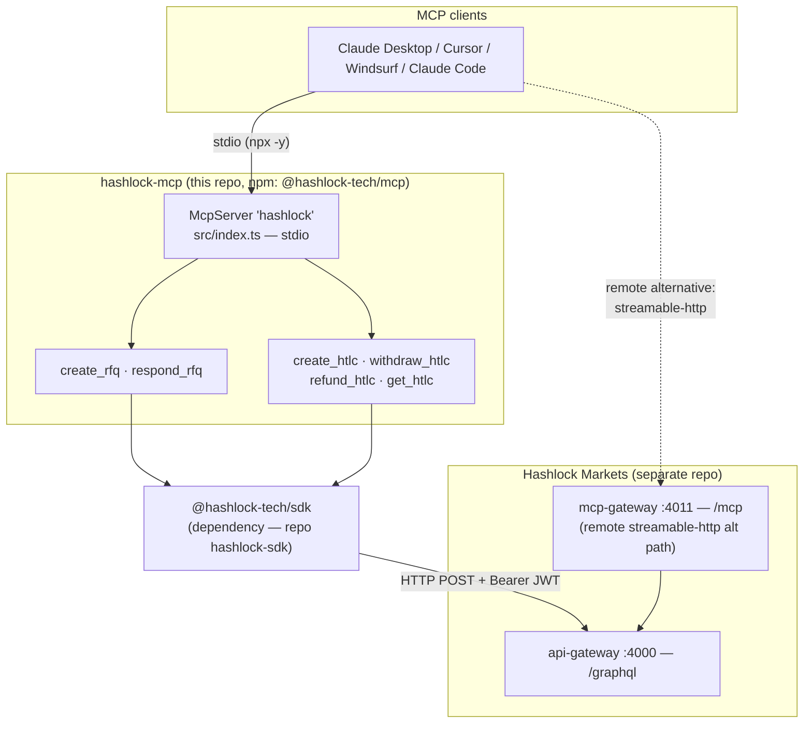
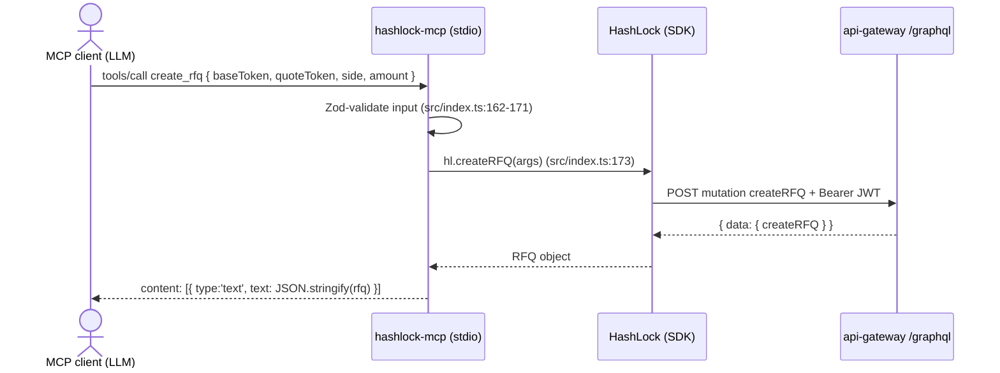

<!-- Язык: [English](./ARCHITECTURE.md) · **Русский** -->

# hashlock-mcp — Архитектура

> **Авторитетный архитектурный справочник по этому репозиторию.** Документ объясняет, что
> представляет собой этот пакет, как связаны его части, как вызов инструмента проходит от
> ИИ-агента к бэкенду Hashlock Markets и обратно, и какая логика стоит за архитектурой — всё
> выверено по ветке `main` (числа соответствуют коду на 2026-05-30).
>
> Это **публикуемый stdio MCP-сервер** для Hashlock Markets. Про систему, с которой он в
> итоге общается, читайте мастер-документ:
> [**hashlock-markets / ARCHITECTURE.md**](https://github.com/Hashlock-Tech/hashlock-markets/blob/main/docs/architecture/ARCHITECTURE.md).
>
> Каждое неочевидное утверждение указывает на `path:line`, который можно открыть. Если число
> здесь когда-либо разойдётся с кодом — прав код, исправьте документ.

---

## 1. Что это такое и центральная идея

`@hashlock-tech/mcp` — это **канонический сервер Model Context Protocol** для Hashlock Markets,
распространяемый через npm и запускаемый через `npx`. Он позволяет любому MCP-совместимому
клиенту — Claude Desktop, Cursor, Windsurf, Claude Code — управлять торговлей Hashlock Markets
(создавать RFQ, котировать как мейкер, регистрировать блокировки HTLC, claim/refund, читать
статус) через шесть инструментов.

Весь сервер — это **один файл**, `src/index.ts` (206 строк), который регистрирует **6
инструментов** на `McpServer` и обслуживает их по **stdio** (`src/index.ts:25,198`). У него нет
собственной бизнес-логики: каждый инструмент — это тонкий адаптер, вызывающий метод клиента
[`@hashlock-tech/sdk`](https://github.com/Hashlock-Tech/hashlock-sdk) (прямая зависимость,
`package.json:33`), который, в свою очередь, говорит по GraphQL с бэкендом.

```
AI agent (MCP client)  →  hashlock-mcp (this, stdio)  →  @hashlock-tech/sdk  →  api-gateway /graphql
```

### Почему сделано именно так (несущие решения)

| Решение | Зачем |
|---|---|
| **Тонкий адаптер над SDK** | Сервер не добавляет ни транспорта, ни retry, ни логики схемы — он импортирует `HashLock` (`src/index.ts:4,18`) и пробрасывает вызовы. Всё сетевое поведение (retry, отображение ошибок, цель `/graphql`) живёт в SDK, поэтому два репозитория не могут разойтись по протоколу. |
| **Транспорт stdio** | `StdioServerTransport` (`src/index.ts:198`) — это то, что десктопные MCP-клиенты запускают как подпроцесс. Поле `bin` + shebang-banner (`package.json:15-17`, `tsup.config.ts:11`) делают собранный `dist/index.js` напрямую исполняемым через `npx -y @hashlock-tech/mcp`. |
| **Описание `create_rfq` — это промпт для LLM, а не просто документация** | Его 59-строчная константа-описание (`src/index.ts:99-157`) — это **компилятор намерений**: она учит модель отображать свободный текст (EN + турецкий) в структурированные параметры, выводить чейны и *переформулировать-и-подтвердить до траты реальных средств*. Тесты пинят её несущие ключевые слова (`src/__tests__/tools.test.ts:201-279`), чтобы редактура не изменила поведение агента молча. |
| **Шесть канонических инструментов, зеркалящих бэкенд** | Набор инструментов (`create_rfq`, `respond_rfq`, `create_htlc`, `withdraw_htlc`, `refund_htlc`, `get_htlc`) — это **те же канонические шесть**, которые предоставляет бэкенд `mcp-gateway`; этот пакет — *скачиваемый stdio-собрат* того продакшн-HTTP-пути (см. §8). |
| **Секреты только через env** | SIWE-JWT читается из `HASHLOCK_ACCESS_TOKEN` (`src/index.ts:16`); ничего не зашито в код. Манифесты MCP-Registry/Smithery помечают его `isSecret` (`mcp-registry.json:36`, `smithery.yaml:13`). |

---

## 2. Система с высоты птичьего полёта



**Как читать:** MCP-клиент запускает этот сервер как stdio-подпроцесс и вызывает его
инструменты. Каждый инструмент пробрасывает вызов в SDK, который POST'ит на **`/graphql`**
бэкенда с Bearer-JWT агента. Пунктирное ребро — это **альтернатива**: вместо локального запуска
этого пакета клиент может подключиться напрямую к удалённому эндпоинту
`https://hashlock.markets/mcp` (бэкендовый `mcp-gateway`) — оба пути предоставляют те же шесть
инструментов (`README.md:22-54`).

---

## 3. Структура пакета

`git ls-files` — это 18 файлов. Код — один модуль; остальное — дистрибуция и конфиг:

| Файл | Роль |
|---|---|
| `src/index.ts` | Весь сервер: настройка SDK-клиента, 6 регистраций инструментов, бутстрап stdio (`src/index.ts:1-206`). |
| `src/__tests__/tools.test.ts` | ~30 кейсов — интеграция инструмент→SDK, пины ключевых слов описания `create_rfq`, проброс экспериментальных полей, сценарии ошибок. |
| `package.json` | npm-метаданные: имя `@hashlock-tech/mcp`, `bin: hashlock-mcp`, зависимости от SDK + MCP SDK + zod (`package.json:2,15-17,32-36`). |
| `mcp-registry.json` | Официальный манифест **MCP Registry** (`io.github.Hashlock-Tech/hashlock`): и npm/stdio-пакет, и удалённый streamable-http эндпоинт (`mcp-registry.json:13-59`). |
| `smithery.yaml` | Манифест установки **Smithery.ai** (stdio через npx, схема конфига). |
| `glama.json` | Указатель каталога **Glama.ai** (maintainer). |
| `llms-install.md` | Руководство по установке, читаемое агентом, для авто-обнаружения. |
| `tsup.config.ts` | Сборка: только ESM + `.d.ts`, shebang-banner, чтобы вывод был исполняемым (`tsup.config.ts:5,11`). |
| `.github/workflows/ci.yml`, `tsconfig.json`, `vitest.config.ts`, `CHANGELOG.md`, `LICENSE`, `.env.example` | CI, конфиг TS, тесты, история, лицензия, шаблон env. |

---

## 4. Шесть инструментов (сердце пакета)

Каждая регистрация `server.tool(name, description, zodSchema, handler)` валидирует вход
Zod-схемой и пробрасывает ровно в один метод SDK:

| Инструмент | Регистрация | Вызывает (SDK) | Назначение |
|---|---|---|---|
| `create_rfq` | `src/index.ts:159` | `createRFQ` | Открыть закрытый RFQ (описание-компилятор намерений, §5) |
| `respond_rfq` | `src/index.ts:180` | `submitQuote` | Мейкер подаёт закрытую котировку |
| `create_htlc` | `src/index.ts:32` | `fundHTLC` | Зарегистрировать tx-хеш он-чейн блокировки HTLC |
| `withdraw_htlc` | `src/index.ts:52` | `claimHTLC` | Забрать, раскрыв прообраз |
| `refund_htlc` | `src/index.ts:69` | `refundHTLC` | Возврат после истечения таймлока |
| `get_htlc` | `src/index.ts:85` | `getHTLCStatus` | Прочитать живой статус HTLC (обе ноги) |

Каждый handler возвращает результат SDK, сериализованный в JSON в MCP-`content` (например,
`src/index.ts:45-46`). Поскольку инструменты делегируют SDK, **чейн-осведомлённость**,
**мультичейн-поддержка** (EVM / Bitcoin / Sui через параметр `chainType`) и семантика
**кросс-чейн RFQ** — ровно те же, что у SDK; см.
[архитектурный документ hashlock-sdk](https://github.com/Hashlock-Tech/hashlock-sdk/blob/main/docs/architecture/ARCHITECTURE.md).

> **Граница «регистрируй, а не подписывай» переносится сюда:** `create_htlc` **не**
> отправляет транзакцию — он регистрирует `txHash`, который кошелёк агента уже отправил
> он-чейн. chain-watcher бэкенда остаётся единственным авторитетом по состоянию сделки
> ([мастер-документ §5.2/§5.6](https://github.com/Hashlock-Tech/hashlock-markets/blob/main/docs/architecture/ARCHITECTURE.md#52-htlc-settlement-on-one-evm-chain)).

---

## 5. Компилятор намерений `create_rfq`

Самая отличительная часть этого репозитория — это **проза, а не код**: строка-описание,
передаваемая в `create_rfq` (`src/index.ts:99-157`). Описания MCP-инструментов читаются
*моделью*, поэтому эта строка фактически является под-промптом, превращающим запрос
пользователя на естественном языке в структурированные параметры `create_rfq`. Она кодирует:

- **Отображение глагол → side** на английском *и турецком* (`sell/sat → SELL`, `buy/al → BUY`,
  `src/index.ts:114-117`).
- **Дефолты вывода чейна** (ETH/USDC/USDT/WBTC/WETH → `ethereum`, BTC → `bitcoin`,
  SUI → `sui`) с явным правилом **никогда молча не переводить неуточнённую ногу на testnet**
  (`src/index.ts:119-124`).
- **Защитные перила**: передавать сырые десятичные суммы (не пред-конвертировать в wei/sats),
  отклонять размеры в USD и **ПЕРЕФОРМУЛИРОВАТЬ разрешённую сделку и получить подтверждение до
  вызова — «Real funds»** (`src/index.ts:126-143`).
- Проработанные **примеры**, включая кросс-чейн образец `SUI/sui ↔ ETH/sepolia`
  (`src/index.ts:145-156`).

`src/__tests__/tools.test.ts:201-279` читает исходник обратно и проверяет, что каждое правило
всё ещё на месте — регрессионный страж, относящийся к промпту как к несущему поведению, а не к
документации.

---

## 6. Потоки и транспорты

### 6.1 Вызов инструмента, от начала до конца



### 6.2 Два способа подключиться (те же шесть инструментов)
- **Локально по stdio (этот пакет)** — `npx -y @hashlock-tech/mcp` с `HASHLOCK_ACCESS_TOKEN`
  в env (`README.md:40-54`, `smithery.yaml:6-9`). SDK нацелен на `/graphql`.
- **Удалённо по streamable-http** — направить клиент на `https://hashlock.markets/mcp` с
  заголовком `Authorization: Bearer` (`README.md:22-38`, `mcp-registry.json:46-59`). Этот
  эндпоинт — бэкендовый `mcp-gateway` (nginx роутит `/mcp` → `mcp-gateway:4011`,
  [мастер-документ §8.1](https://github.com/Hashlock-Tech/hashlock-markets/blob/main/docs/architecture/ARCHITECTURE.md#81-two-mcp-servers-do-not-conflate)).

### 6.3 Аутентификация
Оба пути используют **SIWE 7-дневный JWT** из `hashlock.markets/sign/login` (`README.md:62-70`).
Этот сервер никогда его не выпускает — он только переносит его (env-переменная → SDK
`accessToken`, `src/index.ts:16,20`), что соответствует модели SDK «потребитель bearer-токена,
а не провайдер auth»
([мастер-документ §5.5](https://github.com/Hashlock-Tech/hashlock-markets/blob/main/docs/architecture/ARCHITECTURE.md#55-authentication--human-siwe-and-agent-otk)).

---

## 7. Дистрибуция и обнаружение

Пакет опубликован на четырёх поверхностях агентного обнаружения, все указывают на один и тот
же npm-артефакт:

| Поверхность | Манифест | Идентификатор |
|---|---|---|
| **npm** | `package.json` | `@hashlock-tech/mcp` |
| **MCP Registry** | `mcp-registry.json` | `io.github.Hashlock-Tech/hashlock` (server `1.2.0`, `mcp-registry.json:11`) |
| **Smithery.ai** | `smithery.yaml` | stdio через `npx` (slug `bsozen-4wm5/hashlock-otc-v1`, `README.md:12`) |
| **Glama.ai** | `glama.json` | maintainer `BarisSozen` |

`README.md:140-145` объявляет устаревшими два legacy-пакета (`hashlock-mcp-server`,
`langchain-hashlock`), зависевшие от intent REST API, который «так и не был выпущен» — полезный
честный сигнал об истории проекта.

---

## 8. Как этот репозиторий связан с hashlock-markets

Этот пакет — один из соседних репозиториев, каталогизированных в
[§3 «репозитории и как они связаны»](https://github.com/Hashlock-Tech/hashlock-markets/blob/main/docs/architecture/ARCHITECTURE.md#3-the-repositories-and-how-they-connect)
мастер-документа, и центральный для его
[§8 «поверхность агента / MCP»](https://github.com/Hashlock-Tech/hashlock-markets/blob/main/docs/architecture/ARCHITECTURE.md#8-the-agent--mcp-surface).

| Связь | Деталь |
|---|---|
| **Цепочка зависимостей** | `hashlock-mcp` → `@hashlock-tech/sdk` (`package.json:33`) → api-gateway `/graphql`. Этот сервер наследует эндпоинт, retry и поведение ошибок SDK целиком. |
| **Контракт инструментов = у mcp-gateway** | Шесть инструментов здесь — это **те же канонические шесть**, что предоставляет бэкенд `mcp-gateway` ([мастер §8.1](https://github.com/Hashlock-Tech/hashlock-markets/blob/main/docs/architecture/ARCHITECTURE.md#81-two-mcp-servers-do-not-conflate)). Этот пакет — **локальный-stdio собрат**; `mcp-gateway` — удалённый-HTTP продакшн-путь. Опция удалённой установки буквально указывает на него (`https://hashlock.markets/mcp`). |
| **НЕ путать с `services/remote-mcp`** | Мастер-документ предупреждает о двух бэкенд-MCP-серверах. Этот пакет зеркалит **`mcp-gateway`** (6 канонических инструментов сеттлмента), **а не** `services/remote-mcp` (5 *intent*-инструментов поверх внешнего REST API). Разные инструменты, разный бэкенд. |
| **Модель auth** | Потребляет SIWE-JWT, выпущенный auth-service ([мастер §5.5](https://github.com/Hashlock-Tech/hashlock-markets/blob/main/docs/architecture/ARCHITECTURE.md#55-authentication--human-siwe-and-agent-otk)). |
| **Авторитет сеттлмента** | Инструменты *регистрируют* он-чейн действия; chain-watcher в hashlock-markets решает состояние сделки ([мастер §5.6](https://github.com/Hashlock-Tech/hashlock-markets/blob/main/docs/architecture/ARCHITECTURE.md#56-event-sourcing--chain-watcher-reconciliation-the-spine)). |

> **Известный дрейф документации (отмечен, но здесь не исправляется):**
> - **Противоречие в дефолтном эндпоинте.** Код по умолчанию использует
>   `https://hashlock.markets/graphql` (`src/index.ts:15`), и комментарий над ним
>   (`src/index.ts:6-14`) объясняет, что `/api/graphql` — это cookie-only SSR-прокси, который
>   возвращает 401 для внешних MCP-клиентов. Тем не менее `README.md:90`, `mcp-registry.json:40`
>   и `smithery.yaml:26` документируют дефолт как `https://hashlock.markets/api/graphql` —
>   сломанный путь. **Рантайм корректен**; манифесты устарели. Считайте истиной
>   `src/index.ts:15`.
> - **Три номера версии.** `package.json` — это `0.2.0` (`:3`), литерал версии `McpServer` в
>   коде — `'0.1.12'` (`src/index.ts:27`), а `server.version` в MCP-Registry — `1.2.0`
>   (`mcp-registry.json:11`). Они не согласованы.
> - **Устаревшие legacy-ссылки.** `llms-install.md` и `.env.example:1` всё ещё цитируют
>   скомпрометированный IP `142.93.106.129` и неверное имя пакета `@hashlock/mcp` (каноническое
>   имя — `@hashlock-tech/mcp`, `package.json:2`).
> - **CI не запускает тесты.** `ci.yml:26-28` выполняет только `install → lint → build`;
>   набор `tools.test.ts` из ~30 кейсов никогда не исполняется в CI (его нужно запускать
>   локально через `pnpm test`).
>
> Это запаздывание документации/упаковки, а не дефекты рантайма; их исправление вне рамок
> этого архитектурного PR.

---

## 9. Сборка, тесты и CI

- **Сборка** — `tsup` выдаёт только-ESM `dist/index.js` (+ `.d.ts`) с баннером
  `#!/usr/bin/env node`, чтобы он запускался как CLI (`tsup.config.ts:5,11`).
- **Линт** — `pnpm lint` = `tsc --noEmit` (`package.json:29`).
- **Тесты** — `vitest run` по `tools.test.ts`; покрывает каждый вызов инструмент→SDK, пины
  ключевых слов описания, проброс экспериментальных полей и отображение ошибок. ⚠️ **Запускать
  локально** — CI этого не делает (см. заметку о дрейфе в §8).
- **CI** — `.github/workflows/ci.yml`: `install → lint → build` на Node **18, 20, 22**
  (`ci.yml:14,26-28`).

---

## 10. Глоссарий и что читать дальше

| Термин | Значение |
|---|---|
| **MCP** | Model Context Protocol — протокол вызова инструментов, на котором говорят ИИ-клиенты |
| **stdio-транспорт** | сервер работает как подпроцесс; клиент и сервер обмениваются JSON-RPC через stdin/stdout |
| **Tool (инструмент)** | одна регистрация `server.tool(name, description, schema, handler)` |
| **Intent compiler (компилятор намерений)** | описание `create_rfq` — под-промпт для LLM, превращающий свободный текст в параметры |
| **HTLC / RFQ / SIWE / прообраз** | см. [глоссарий hashlock-sdk](https://github.com/Hashlock-Tech/hashlock-sdk/blob/main/docs/architecture/ARCHITECTURE.md#9-glossary--where-to-read-next) и [мастер-документ §11](https://github.com/Hashlock-Tech/hashlock-markets/blob/main/docs/architecture/ARCHITECTURE.md#11-glossary--where-to-read-next) |

**Что читать дальше:**
- Весь сервер — `src/index.ts` (начните с регистраций инструментов, `:32`).
- SDK, который он оборачивает — [hashlock-sdk / ARCHITECTURE.md](https://github.com/Hashlock-Tech/hashlock-sdk/blob/main/docs/architecture/ARCHITECTURE.md).
- Бэкенд, которым он в итоге управляет — [hashlock-markets / ARCHITECTURE.md](https://github.com/Hashlock-Tech/hashlock-markets/blob/main/docs/architecture/ARCHITECTURE.md).

---

*Английская версия — [`ARCHITECTURE.md`](./ARCHITECTURE.md).*
